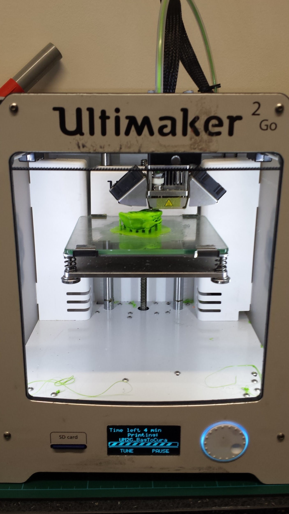

***Wednesday 12th***

We have our first 3D print!

After taking a simple scan of a rucksack, we’ve produced a scaled down
3D printed version. The green shows a lower resolution, and the orange
higher. We also produced a 3D print of a gear system, which can
hopefully be used to slow down the rotation speed of the turntable.

{width="2.151042213473316in"
height="2.8202548118985127in"}{width="2.9177055993000875in"
height="1.9322922134733158in"}

The lower resolution prints took only \~30 mins, whereas the higher
resolution print took roughly 2 and a half hours!

The final results of the low resolution prints came out very nicely as
seen below. Note that the support structure from the prints has yet to
be removed!

{width="3.4319739720034996in"
height="2.5781255468066493in"}
