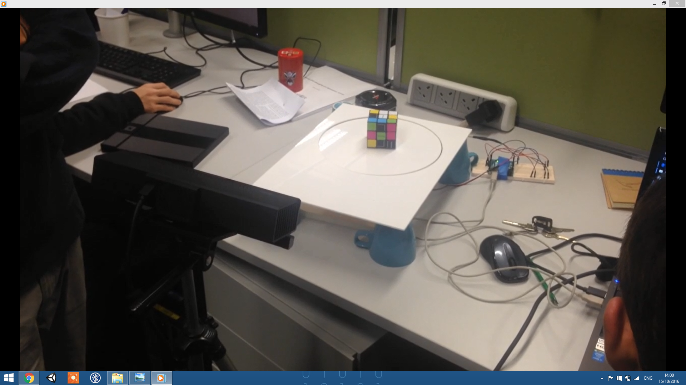
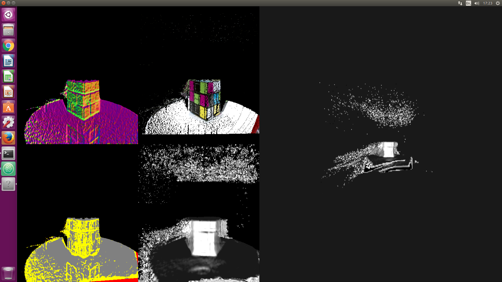

***October 13th***

A new and improved turntable prototype has now been designed! And the
results from preliminary tests are impressive. \[Video on site, not just
image as below\]

{width="4.6875in"
height="2.6666666666666665in"}

By making use of \[OS software\], high quality meshes were attainable
with a fixed camera and simple rotating objects. The output from the
software demonstrates its ability to capture detail robustly.

{width="5.354166666666667in"
height="3.0983497375328084in"}

In this diagram, (a) represents \[blah\], (b) represents \[blah\], (c)
represents \[blah\], (d) represents \[blah\], and (e) represents
\[blah\]. Next job, see if we can 3D print one of these turntable scans
to a high standard!
